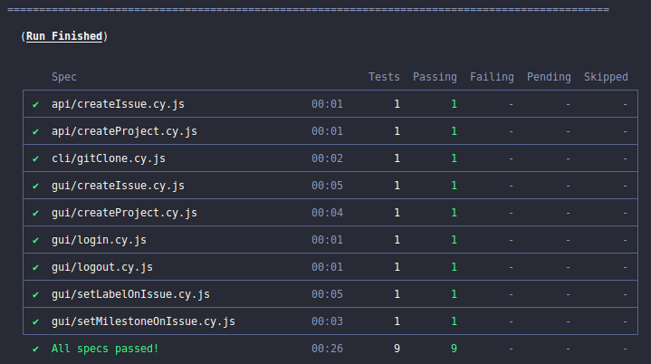

# Cypress Gitlab CE

Este é um projeto incrível que utiliza Docker para facilitar o desenvolvimento e a implantação, juntamente com o Cypress para realizar testes em uma aplicação web no container GitLab CE.

## Pré-requisitos

Certifique-se de ter o Docker e o Docker Compose instalados em sua máquina antes de prosseguir.

- Docker: [Instalação do Docker](https://docs.docker.com/get-docker/)
- Docker Compose: [Instalação do Docker Compose](https://docs.docker.com/compose/install/)

## Como usar

1. Clone este repositório em sua máquina:

   ```shell
   git clone git@github.com:vitorsemidio-dev/cypress-gitlab-ce.git
   ```

2. Navegue até o diretório do projeto:

   ```shell
   cd cypress-gitlab-ce
   ```

3. Levante os containers utilizando o Docker Compose:

   ```shell
   docker-compose up -d
   ```

   Isso irá iniciar o container GitLab CE e a aplicação estará disponível em [http://localhost](http://localhost).

4. Verifique se os containers estão em execução:

   ```shell
   docker-compose ps
   ```

   Você deverá ver uma lista dos containers em execução.

5. Instale as dependências do projeto:

   ```shell
    npm install
   ```

6. Preencha as variáveis de ambiente:

   ```shell
    cp cypress.env.example.json cypress.env.json
   ```

Para conseguir os valores a serem preenchidos, acesse o seguinte link onde mostra o passo a passo:

[0. _Setup_ do ambiente local com Docker](./lessons/0.md)

7. Inicie o cypress:

   (modo interativo)

   ```shell
    npm run cy:open
   ```

   .png>)
   .png>)

   (modo headless):

   ```shell
    npm run cy:run
   ```



## Parar os containers

Se desejar parar os containers, execute o seguinte comando na raiz do projeto:

```shell
docker-compose down
```

Isso irá parar e remover os containers, mas os dados persistentes serão preservados.

Se você quiser apenas parar os containers temporariamente (sem removê-los), você pode executar:

```shell
docker-compose stop
```

## Aulas

- [0. _Setup_ do ambiente local com Docker](./lessons/0.md)
- [1. _Setup_ do projeto de testes com Cypress](./lessons/1.md)
- [2. Testando a funcionalidade _login_](./lessons/2.md)
- [3. Testando a funcionalidade de _logout_](./lessons/3.md)
- [4. Testando a funcionalidade de criação de projeto](./lessons/4.md)
- [5. Testando criação de issue](./lessons/5.md)
- [6. Testando criação de projeto via API](./lessons/6.md)
- [7. Testando criação de _issue_ via API](./lessons/7.md)
- [8. Testando a adição de uma etiqueta (_label_) à uma issue](./lessons/8.md)
- [9. Testando a adição de um marco (_milestone_) à uma _issue_](./lessons/9.md)
- [10. Executando comandos a nível de sistema](./lessons/10.md)
- [11. Executando todos os testes](./lessons/11.md)
- [12. Executando os testes em modo interativo](./lessons/12.md)
- [13. Desligando o container](./lessons/13.md)
- [14. Conteúdos de Cypress da Talking About Testing](./lessons/14.md)

## Contribuindo

Se você quiser contribuir para este projeto, fique à vontade para enviar pull requests. Ficarei feliz em analisá-los!
